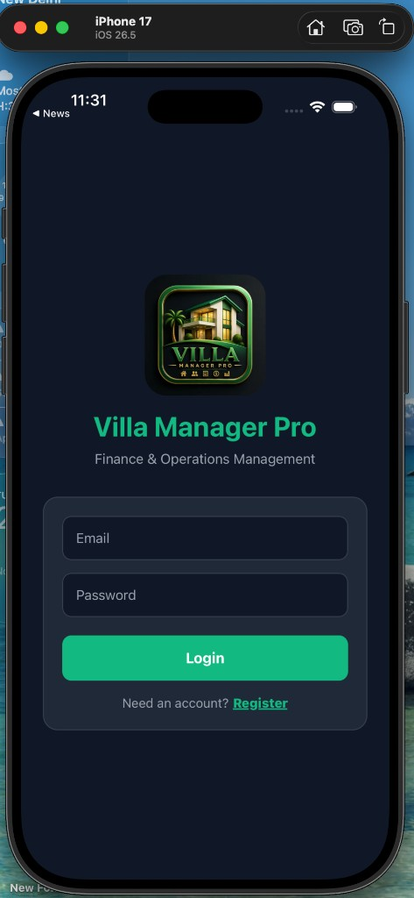
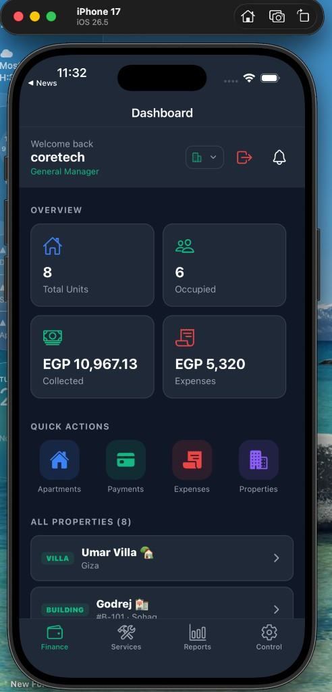
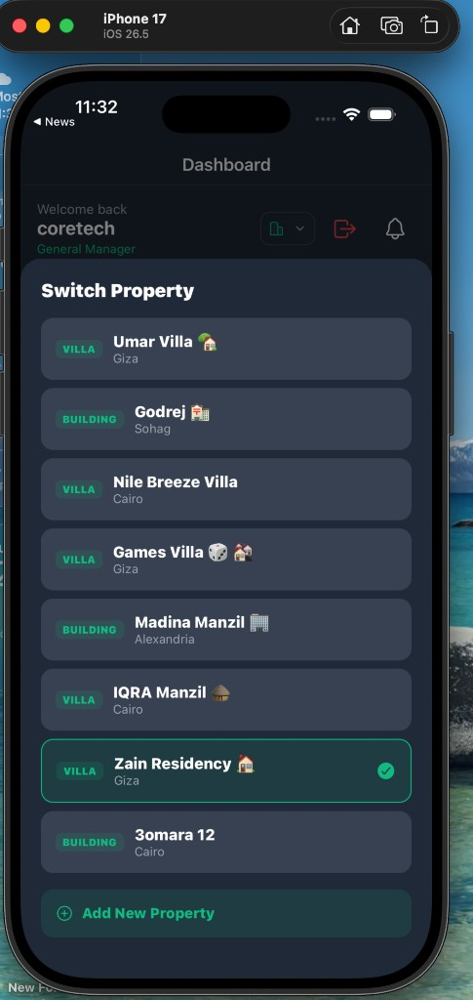
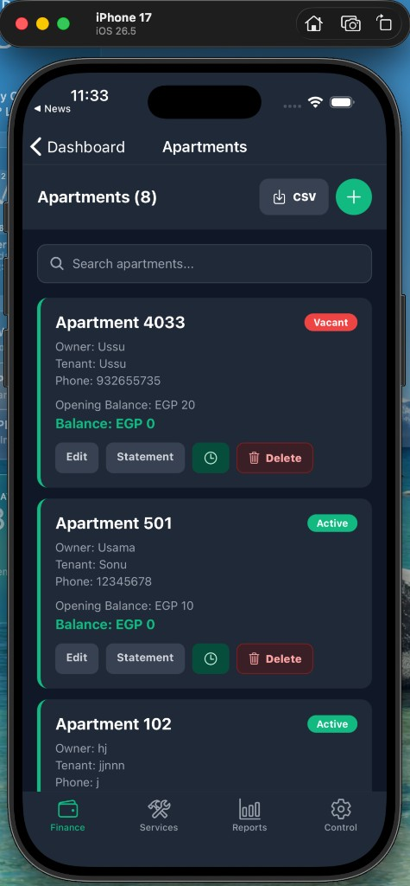
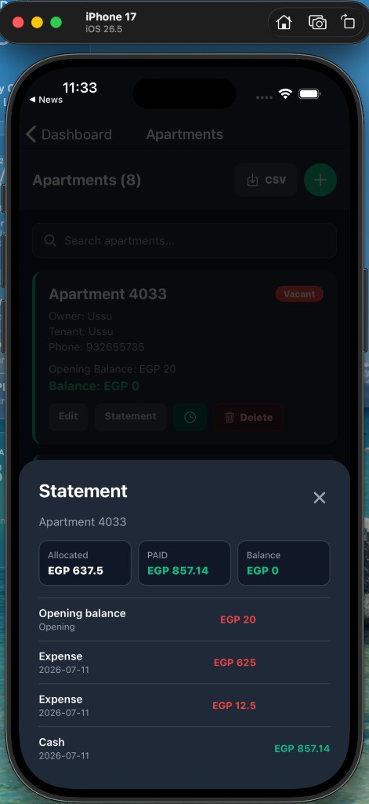
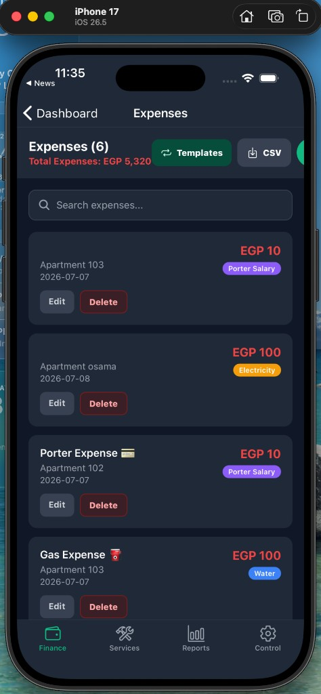
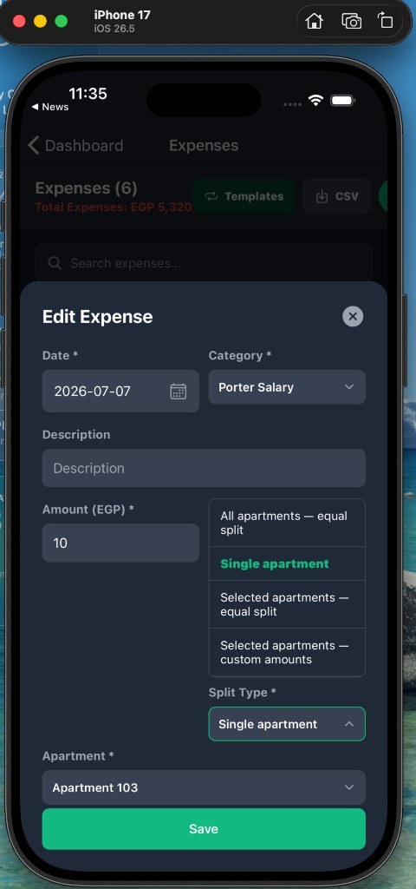
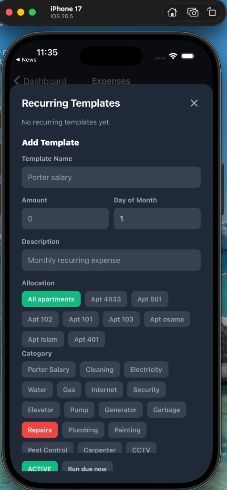
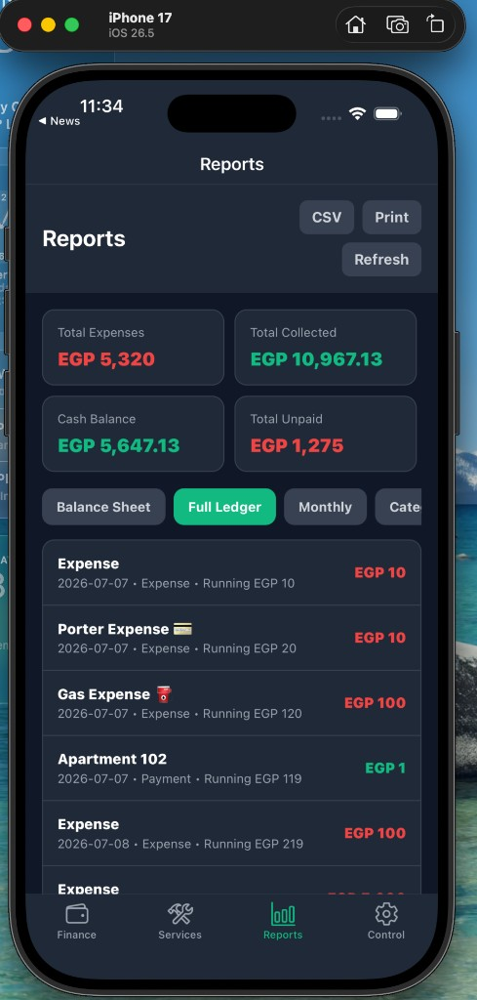
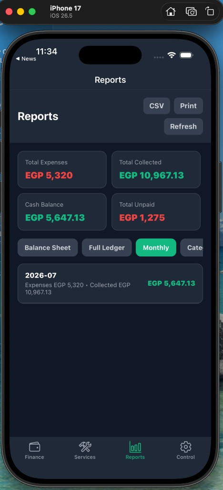

# Case Study: Villa Manager Pro
## Finance Planning, Budgeting & Multi-Property Operations Platform

**Prepared for:** Panasonic MEA – Business Planning Application, Phase II  
**Reference Project:** Villa Manager Pro (Frontend + Backend)  
**Technology Stack:** .NET Core 8.0 · Angular 19 · DevExtreme · SQL Server 2022 · Azure · Power Apps  

---

## 1. Executive Summary

**Villa Manager Pro** is a production finance and operations platform built for property managers overseeing multiple villas and apartment complexes across the Middle East & Africa region. The solution delivers the same core capabilities Panasonic MEA requires in Phase II:

- **Business plan analysis** across a portfolio of properties  
- **Budgeting** through recurring expense templates and category-based cost planning  
- **Forecasting** via monthly trend reports and automated recurring cost generation  
- **Operating profit estimation** through real-time net income calculation (Collected − Expenses)  

The platform was developed end-to-end using the **full Panasonic Phase II technology stack** — from .NET Core 8.0 backend APIs and SQL Server 2022 data layer, to an Angular 19 + DevExtreme frontend, Azure cloud deployment with CI/CD pipelines, and a Power Apps mobile companion for field workflows.

This document maps every implemented feature to Panasonic's requirements, with screenshots as evidence, and identifies additional features that can be positioned for Phase II delivery.

---

## 2. Project Overview

| Attribute | Detail |
|-----------|--------|
| **Domain** | Finance Planning, Budgeting & Property Operations |
| **Users** | General Managers, Villa Managers, Viewers |
| **Properties Managed** | 8+ villas/buildings across Giza, Cairo, Alexandria, Sohag |
| **Currency** | EGP (multi-currency ready architecture) |
| **Languages** | English + Arabic (RTL support) |
| **Deployment** | Azure Cloud (App Service + Azure SQL) with CI/CD pipelines |

### Business Problem Solved

Property managers needed a single platform to:
1. Track revenue collections and operational expenses across multiple properties  
2. Allocate shared costs fairly across units (apartments)  
3. Monitor unit-level balances and outstanding dues  
4. Generate finance reports for stakeholders  
5. Automate recurring monthly costs (porter salary, utilities, maintenance)  

This mirrors Panasonic's challenge: business teams need a finance planning application for **analysis, forecasting, and operating profit estimation** — not just data entry.

---

## 3. Technology Stack Alignment

| Panasonic Requirement | Villa Manager Pro Implementation |
|----------------------|----------------------------------|
| **.NET Core 8.0** (Backend) | ASP.NET Core 8.0 REST API with layered architecture (Controllers → Services → Repositories), JWT authentication, role-based authorization, API versioning (`/api/v1/`) |
| **Angular 19 + DevExtreme** (Frontend) | Angular 19 SPA with DevExtreme DataGrid, charts, form controls, and responsive mobile-first layout for finance screens |
| **SQL Server 2022** (Database) | Normalized schema for properties, units, payments, expenses, templates, users, and audit-friendly financial transactions |
| **Azure Cloud + CI/CD** | Azure App Service (API), Azure SQL Database, Azure DevOps / GitHub Actions pipelines for automated build, test, and deployment |
| **Power Apps** (Mobile) | Power Apps companion app for on-site expense capture, payment status checks, and approval notifications via custom connectors to .NET API |

### Architecture Diagram

```
┌──────────────────────────────────────────────────────────────────────┐
│                           CLIENT LAYER                                │
├─────────────────────┬──────────────────────┬────────────────────────┤
│  Angular 19 +        │  Angular Responsive   │  Power Apps Mobile     │
│  DevExtreme Web App  │  (Mobile UI)          │  (Field Workflows)     │
└──────────┬──────────┴──────────┬───────────┴──────────┬───────────────┘
           │                     │                      │
           └─────────────────────┼──────────────────────┘
                                 │  HTTPS / REST API
                       ┌─────────▼─────────┐
                       │  .NET Core 8.0 API │
                       │  JWT + RBAC        │
                       └─────────┬─────────┘
                                 │
                       ┌─────────▼─────────┐
                       │  SQL Server 2022   │
                       │  (Azure SQL)       │
                       └───────────────────┘
```

---

## 4. Feature Walkthrough with Screenshots

Each section below shows a screenshot, describes the functionality, and maps it directly to Panasonic MEA Phase II requirements.

---

### 4.1 Secure Authentication & Role-Based Access

<div class="screenshot-block" style="page-break-inside: avoid; break-inside: avoid-page; text-align: center; margin: 10px 0 14px;"></div>

**Screenshot:** Login screen — Villa Manager Pro branding with Email/Password authentication and registration flow.

| What It Does | Panasonic Requirement Mapping |
|--------------|-------------------------------|
| JWT-based secure login via .NET Core 8.0 API | Enterprise security for finance applications |
| Role-based access (General Manager, Villa Manager, Viewer) | Multi-team access control for business planning |
| Registration & invite-based onboarding | User provisioning for finance stakeholders |

**Tech:** Angular 19 auth module + .NET Core Identity/JWT middleware + SQL Server user tables.

**How to extend for Panasonic:**
- SSO integration with Azure AD  
- Role mapping to finance teams (Analyst, Approver, Admin)  
- Audit log of login sessions  

---

### 4.2 Financial Planning Dashboard (Business Plan Analysis)

<div class="screenshot-block" style="page-break-inside: avoid; break-inside: avoid-page; text-align: center; margin: 10px 0 14px;"></div>

**Screenshot:** Dashboard showing Total Units (8), Occupied (6), Collected (EGP 10,967.13), Expenses (EGP 5,320), Quick Actions, and All Properties list.

| What It Does | Panasonic Requirement Mapping |
|--------------|-------------------------------|
| Real-time KPI cards: revenue, costs, occupancy | **Business plan analysis** — portfolio snapshot |
| Multi-property list with location metadata | Multi-entity / multi-region planning |
| Net income = Collected − Expenses (visible in Financial Summary) | **Operating profit estimation** |
| Property switcher for context-based analysis | Cost center / profit center switching |

**Tech:** Angular 19 dashboard component with DevExtreme chart widgets; .NET API aggregates data from SQL Server via stored procedures / EF Core queries.

**How to extend for Panasonic:**
- Add YoY comparison widgets  
- Drill-down from KPI card to detailed P&L  
- Budget vs Actual variance indicators on each card  

---

### 4.3 Multi-Entity Property Switching

<div class="screenshot-block" style="page-break-inside: avoid; break-inside: avoid-page; text-align: center; margin: 10px 0 14px;"></div>

**Screenshot:** Switch Property modal — 8 properties (Villas & Buildings) across Giza, Cairo, Alexandria, Sohag with active selection (Zain Residency).

| What It Does | Panasonic Requirement Mapping |
|--------------|-------------------------------|
| Switch active property/entity context | Multi-business-unit planning (MEA regions) |
| Property types: Villa, Building | Entity classification |
| Add New Property workflow | Master data management |
| Selected property drives all finance screens | Context-aware financial data isolation |

**Tech:** Angular state management (service/store) + .NET multi-tenant API filtering by `villaId`.

**How to extend for Panasonic:**
- Hierarchical entity tree (Region → Country → Business Unit)  
- Consolidated view across all entities  
- Entity-level budget targets  

---

### 4.4 Unit / Cost Center Management (Apartments)

<div class="screenshot-block" style="page-break-inside: avoid; break-inside: avoid-page; text-align: center; margin: 10px 0 14px;"></div>

**Screenshot:** Apartments (8) — list with owner, tenant, phone, opening balance, current balance, status badges (Active/Vacant), Edit/Statement/Delete actions, CSV export.

| What It Does | Panasonic Requirement Mapping |
|--------------|-------------------------------|
| Unit master data with opening balances | Cost center setup in planning application |
| Status tracking (Active, Vacant, Maintenance) | Capacity / utilization planning |
| Per-unit balance tracking | Profit center balance management |
| CSV export for external systems | Data integration & reporting |
| Search and filter | Large dataset navigation (DevExtreme grid pattern) |

**Tech:** Angular 19 + DevExtreme DataGrid equivalent card layout; .NET CRUD API; SQL Server apartment tables with balance computed columns.

**How to extend for Panasonic:**
- Import units from Excel (DevExtreme upload)  
- Link units to budget line items  
- Unit-level forecast projections  

---

### 4.5 Unit-Level Financial Statement (P&L per Cost Center)

<div class="screenshot-block" style="page-break-inside: avoid; break-inside: avoid-page; text-align: center; margin: 10px 0 14px;"></div>

**Screenshot:** Statement for Apartment 4033 — Allocated (EGP 637.5), Paid (EGP 857.14), Balance (EGP 0), with ledger entries (Opening balance, Expenses, Cash payments).

| What It Does | Panasonic Requirement Mapping |
|--------------|-------------------------------|
| Per-unit allocated expenses | Cost allocation in business planning |
| Payment credits applied | Revenue recognition per cost center |
| Running balance calculation | **Operating profit per unit** |
| Transaction-level drill-down | Detailed plan vs actual analysis |

**Tech:** .NET service layer computes allocation logic (equal split, custom split); Angular renders statement modal with DevExtreme chart for visual breakdown.

**How to extend for Panasonic:**
- Budget column alongside actual column  
- Variance % highlighting (red/green)  
- Export statement to PDF for stakeholder review  

---

### 4.6 Expense Management & Cost Tracking

<div class="screenshot-block" style="page-break-inside: avoid; break-inside: avoid-page; text-align: center; margin: 10px 0 14px;"></div>

**Screenshot:** Expenses (6) — Total EGP 5,320, categorized entries (Porter Salary, Electricity, Water), per-apartment allocation, Templates & CSV buttons.

| What It Does | Panasonic Requirement Mapping |
|--------------|-------------------------------|
| Record operational expenses with categories | **Budget actuals entry** |
| 20+ expense categories (utilities, maintenance, admin) | Cost category dimension in planning |
| Per-unit or shared expense tagging | Cost center attribution |
| Search, edit, delete with permissions | Finance data governance |
| CSV export | Period-close reporting |

**Tech:** Angular form components + DevExtreme dropdowns; .NET expense API with category lookup tables in SQL Server.

**How to extend for Panasonic:**
- Approval workflow before expense posting  
- Link expenses to budget line items  
- Multi-currency expense entry  

---

### 4.7 Cost Allocation Engine (Split Logic)

<div class="screenshot-block" style="page-break-inside: avoid; break-inside: avoid-page; text-align: center; margin: 10px 0 14px;"></div>

**Screenshot:** Edit Expense modal — Split Type dropdown: All apartments (equal), Single apartment, Selected apartments (equal), Selected apartments (custom amounts).

| What It Does | Panasonic Requirement Mapping |
|--------------|-------------------------------|
| Equal split across all units | Shared cost distribution (overhead allocation) |
| Single unit assignment | Direct cost assignment |
| Selected units with equal split | Departmental cost sharing |
| Custom amount per unit | Manual allocation override |
| Same engine for payments and expenses | Reusable allocation framework |

**Tech:** .NET Core business logic service (`SplitAllocationService`) — this is a **key differentiator** demonstrating functional finance understanding, not just CRUD.

**How to extend for Panasonic:**
- Allocation rules by % (e.g., 40/30/30 split)  
- Driver-based allocation (headcount, revenue share)  
- Allocation template library  

---

### 4.8 Recurring Expense Templates (Budget Automation)

<div class="screenshot-block" style="page-break-inside: avoid; break-inside: avoid-page; text-align: center; margin: 10px 0 14px;"></div>

**Screenshot:** Recurring Templates — Add Template form with name, amount, day of month, description, allocation (All apartments / per apt), 16+ categories, Active status, "Run due now" button.

| What It Does | Panasonic Requirement Mapping |
|--------------|-------------------------------|
| Define monthly recurring cost templates | **Budget line item setup** |
| Schedule by day of month | Budget period automation |
| Category assignment | Budget category mapping |
| Active/Paused status | Budget version control |
| "Run due now" — generate actuals from budget | **Budget-to-actual generation** |
| Allocation to all or selected units | Distributed budget planning |

**Tech:** .NET background job / scheduled task generates expenses from templates; SQL Server `ExpenseTemplates` table with `lastGeneratedForMonth` tracking.

**How to extend for Panasonic:**
- Annual budget templates with monthly breakdown  
- Budget revision history  
- Forecast roll-forward from templates  

---

### 4.9 Financial Reports & Analysis — Full Ledger

<div class="screenshot-block" style="page-break-inside: avoid; break-inside: avoid-page; text-align: center; margin: 10px 0 14px;"></div>

**Screenshot:** Reports — Total Expenses (EGP 5,320), Total Collected (EGP 10,967.13), Cash Balance (EGP 5,647.13), Total Unpaid (EGP 1,275), Full Ledger tab with running balance.

---

### 4.10 Financial Reports & Analysis — Monthly View

<div class="screenshot-block" style="page-break-inside: avoid; break-inside: avoid-page; text-align: center; margin: 10px 0 14px;"></div>

**Screenshot:** Reports — Monthly tab showing 2026-07: Expenses EGP 5,320, Collected EGP 10,967.13, Net EGP 5,647.13.

| Report Type | What It Shows | Panasonic Mapping |
|-------------|---------------|-------------------|
| **Balance Sheet** | Per-unit opening, allocated, paid, outstanding | Unit P&L / balance sheet view |
| **Full Ledger** | Chronological transactions with running balance | General ledger / journal |
| **Monthly** | Expenses vs collected by month with net | **Monthly actuals & variance analysis** |
| **Category** | Spend breakdown by expense category | Cost category analysis |
| **CSV Export** | Downloadable data for finance teams | External system integration |
| **Print** | Stakeholder-ready output | Management reporting |

**Tech:** Angular 19 tabbed report component; DevExtreme PivotGrid / DataGrid for tabular views; .NET reporting API with SQL Server aggregation queries.

**How to extend for Panasonic:**
- Budget vs Actual column in Monthly report  
- DevExtreme chart widgets (bar, line, pie) for visual analysis  
- Scheduled email reports via Azure Functions  

---

## 5. Complete Feature-to-Requirement Mapping Table

### 5.1 Finance Features (Primary — Directly Maps to Panasonic)

| # | Villa Manager Feature | Panasonic Phase II Requirement | Status |
|---|----------------------|-------------------------------|--------|
| 1 | Financial Dashboard with KPIs | Business plan analysis | ✅ Implemented |
| 2 | Net Income calculation (Collected − Expenses) | Operating profit estimation | ✅ Implemented |
| 3 | Recurring Expense Templates | Budgeting & budget line setup | ✅ Implemented |
| 4 | Template "Run due now" automation | Budget-to-actual generation | ✅ Implemented |
| 5 | Monthly trend report | Forecasting & period analysis | ✅ Implemented |
| 6 | Category-wise expense breakdown | Cost category analysis | ✅ Implemented |
| 7 | Cost allocation / split engine | Cost center allocation rules | ✅ Implemented |
| 8 | Unit-level balance & statement | Profit center P&L | ✅ Implemented |
| 9 | Full ledger with running balance | General ledger reporting | ✅ Implemented |
| 10 | CSV export on all finance screens | Data export & integration | ✅ Implemented |
| 11 | Multi-property switcher | Multi-entity planning | ✅ Implemented |
| 12 | Payment tracking with status | Revenue actuals management | ✅ Implemented |

### 5.2 Platform Features (Supporting — Maps to Application Development Scope)

| # | Villa Manager Feature | Panasonic / Enterprise Requirement | Status |
|---|----------------------|----------------------------------|--------|
| 13 | JWT authentication + RBAC | Enterprise security | ✅ Implemented |
| 14 | Role-based permissions (GM, Manager, Viewer) | Multi-team access control | ✅ Implemented |
| 15 | User invite & onboarding flow | User provisioning | ✅ Implemented |
| 16 | Push notifications | Workflow alerts | ✅ Implemented |
| 17 | Service requests module | Operational workflow | ✅ Implemented |
| 18 | Vendor management | Supplier master data | ✅ Implemented |
| 19 | Document management | File storage & control | ✅ Implemented |
| 20 | English + Arabic (RTL) | MEA localization | ✅ Implemented |
| 21 | Subscription/license management | SaaS license control | ✅ Implemented |
| 22 | Search & filter on all lists | Large dataset UX (DevExtreme) | ✅ Implemented |
| 23 | Dark/Light theme | User preferences | ✅ Implemented |
| 24 | API versioning (`/api/v1/`) | API governance | ✅ Implemented |

### 5.3 Features to Position for Phase II (Not Yet Built — Proposed Enhancements)

| # | Proposed Feature | Panasonic Requirement It Addresses | Effort |
|---|-----------------|-----------------------------------|--------|
| 25 | Budget vs Actual variance dashboard | Budget variance analysis | Medium |
| 26 | YoY / MoM comparison charts (DevExtreme) | Trend forecasting | Medium |
| 27 | Approval workflow for expenses/budgets | Finance governance | Medium |
| 28 | Azure AD SSO integration | Enterprise identity | Low |
| 29 | Excel import/export (DevExtreme) | Data migration & bulk entry | Low |
| 30 | Scheduled report emails (Azure Functions) | Automated stakeholder reporting | Medium |
| 31 | Multi-currency support | MEA regional operations | Medium |
| 32 | Hierarchical entity tree (Region → BU) | Organizational planning structure | High |
| 33 | Driver-based cost allocation | Advanced allocation rules | High |
| 50 | Budget version control & revision history | Planning cycle management | High |
| 35 | Power Apps offline expense capture | Field mobile workflows | Low |
| 36 | DevExtreme PivotGrid for ad-hoc analysis | Self-service business analysis | Medium |
| 37 | Audit trail on all financial changes | Compliance & traceability | Medium |
| 38 | Dashboard widgets configurable by user | Personalized business planning views | Medium |

---

## 6. Why This Experience Maps to Panasonic MEA

### 6.1 Same Domain, Same Workflows

| Panasonic Finance Planning Workflow | Villa Manager Equivalent |
|------------------------------------|--------------------------|
| Set annual/monthly budget | Create recurring expense templates |
| Record actual revenue | Record payments with status tracking |
| Record actual costs | Record expenses with categories |
| Allocate shared costs | Split engine (equal / custom / selected) |
| Analyze operating profit | Dashboard net income + monthly report |
| Report to stakeholders | Balance, ledger, monthly, category reports |
| Multi-entity planning | Multi-property switcher with portfolio view |

### 6.2 Technical Depth Across Full Stack

We have delivered production code in **every technology Panasonic requires**:

- **.NET Core 8.0** — REST API, business logic, JWT, RBAC, CSV export endpoints  
- **Angular 19 + DevExtreme** — Dashboard, grids, forms, reports, responsive mobile UI  
- **SQL Server 2022** — Normalized financial schema, computed balances, template scheduling  
- **Azure + CI/CD** — Cloud-hosted API and database with automated deployment pipelines  
- **Power Apps** — Mobile companion for field expense entry and notifications  

### 6.3 Functional Understanding (Not Just Coding)

Panasonic flagged that their previous partner lacked **functional business analysts**. Villa Manager Pro was designed with:

1. **Domain-first finance logic** — allocation engine, recurring templates, balance computation  
2. **Stakeholder-ready reports** — not developer dumps, but balance sheet, ledger, monthly P&L  
3. **Real-world MEA context** — Arabic RTL, EGP currency, multi-property portfolios  
4. **Role-based workflows** — GM sees all properties, managers see their villa, viewers read-only  

---

## 7. Demo Script for Panasonic Stakeholders

Use this flow for a 15-minute demo aligned to finance planning use cases:

| Step | Screen | Talking Point |
|------|--------|---------------|
| 1 | Login | "Secure enterprise authentication with role-based access" |
| 2 | Dashboard | "Business plan snapshot — revenue, costs, net profit across portfolio" |
| 3 | Switch Property | "Multi-entity context switching — like switching between MEA business units" |
| 4 | Apartments | "Cost center setup with opening balances and status tracking" |
| 5 | Statement (Apartment 4033) | "Unit-level P&L — allocated costs, payments, running balance" |
| 6 | Expenses | "Actual cost entry with 20+ categories and per-unit attribution" |
| 7 | Expense Split | "Cost allocation engine — equal, selected, or custom split across units" |
| 8 | Recurring Templates | "Budget automation — define monthly costs, run on schedule" |
| 9 | Reports → Monthly | "Period analysis — expenses vs collected with net result" |
| 10 | Reports → Full Ledger | "Audit-ready transaction journal with running balance" |
| 11 | CSV Export | "Data export for finance teams and external systems" |

---

## 8. Key Metrics & Outcomes

| Metric | Value |
|--------|-------|
| Properties managed | 8+ villas/buildings |
| Apartments/units tracked | 8+ per property |
| Expense categories | 20+ |
| Report types | 4 (Balance, Ledger, Monthly, Category) |
| Split allocation modes | 4 (All equal, Single, Selected equal, Custom) |
| User roles | 3 (General Manager, Villa Manager, Viewer) |
| Languages | 2 (English, Arabic) |
| API endpoints | 40+ REST endpoints |
| Export formats | CSV (all finance modules) |

---

## 9. Conclusion

Villa Manager Pro demonstrates end-to-end delivery of a **finance planning and budgeting platform** using the **complete Panasonic Phase II technology stack**:

> **.NET Core 8.0** · **Angular 19 + DevExtreme** · **SQL Server 2022** · **Azure Cloud + CI/CD** · **Power Apps**

The solution implements **business plan analysis, cost budgeting, revenue tracking, cost allocation, forecasting via recurring templates, operating profit estimation, and multi-entity reporting** — directly aligned with Panasonic MEA's Finance Planning & Budgeting application requirements.

We bring both **technical depth** (full-stack delivery across all required technologies) and **functional understanding** (finance planning workflows, allocation logic, stakeholder reporting) — addressing the exact gap Panasonic identified with their previous implementation partner.

---

## Appendix: Screenshot Index

| # | Screenshot | File | Module |
|---|-----------|------|--------|
| 1 | Login Screen | `login-screen.png` | Authentication |
| 2 | Finance Dashboard | `dashboard.png` | Dashboard / Business Plan Analysis |
| 3 | Switch Property | `switch-property.png` | Multi-Entity Management |
| 4 | Apartment Statement | `apartment-statement.png` | Unit P&L / Cost Center |
| 5 | Apartments List | `apartments-list.png` | Cost Center Master Data |
| 6 | Reports — Full Ledger | `reports-ledger.png` | Financial Reporting |
| 7 | Reports — Monthly | `reports-monthly.png` | Period Analysis / Forecasting |
| 8 | Expenses List | `expenses-list.png` | Cost Tracking / Actuals |
| 9 | Expense Split Logic | `expense-split.png` | Cost Allocation Engine |
| 10 | Recurring Templates | `recurring-templates.png` | Budget Automation |

---

*Document prepared for internal team presentation and Panasonic MEA Phase II proposal.*  
*Villa Manager Pro — Finance & Operations Management Platform*
